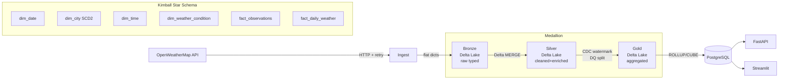

# Weather Data Warehouse Pipeline v3

A production-grade Weather Data Warehouse built on PySpark, Delta Lake, and PostgreSQL.

**Stack:** Python 3.11 · PySpark 3.5 · delta-spark 3.1 · PostgreSQL 15 · FastAPI 0.110 · Streamlit 1.32 · Docker · GitHub Actions

---

## Architecture



---

## Advanced Concepts

| Concept | Implementation |
|---|---|
| Kimball star schema | Surrogate keys, conformed dims, degenerate dims |
| SCD Type 2 | Full attribute history on `dim_city` via distributed join |
| Delta Lake | ACID MERGE/UPSERT on every layer, time travel available |
| Medallion architecture | Bronze → Silver → Gold → Warehouse |
| CDC | Watermark stored in PostgreSQL, survives between GitHub Actions runs |
| OLAP | ROLLUP, CUBE, GROUPING SETS, gaps-and-islands streak detection |
| Row-Level Security | PostgreSQL RLS with `FORCE ROW LEVEL SECURITY` |
| Audit log | Trigger-based JSONB change log on all fact tables |
| Field-level encryption | Fernet on sensitive columns via `crypto.py` |
| Secrets | `pydantic-settings` + `SecretStr`, no raw `os.environ` in business logic |
| Data quality | Inline DQ split + quarantine Delta table |

---

## Prerequisites

- Python 3.11+
- Java 17 (required by PySpark)
- Docker (for local PostgreSQL)

```bash
# WSL/Ubuntu: install Java if missing
sudo apt update && sudo apt install openjdk-17-jdk -y
export JAVA_HOME=/usr/lib/jvm/java-17-openjdk-amd64
echo 'export JAVA_HOME=/usr/lib/jvm/java-17-openjdk-amd64' >> ~/.bashrc
```

---

## Local Setup

### 1. Clone and install

```bash
git clone https://github.com/YOUR_USERNAME/weather-dwh.git
cd weather-dwh
python -m venv .venv && source .venv/bin/activate
pip install -r requirements.txt
```

### 2. Generate secrets

```bash
# JWT secret key
python -c "import secrets; print(secrets.token_hex(32))"

# Fernet encryption key
python -c "from cryptography.fernet import Fernet; print(Fernet.generate_key().decode())"

# API key hash salt
python -c "import secrets; print(secrets.token_hex(16))"
```

### 3. Configure `.env`

```bash
cp .env.example .env
# Edit .env — fill in OWM_API_KEY, DATABASE_URL, SUPABASE_*, and the three generated secrets
```

### 4. Start PostgreSQL (local dev)

```bash
docker compose up -d postgres
```

### 5. Apply database schema

```bash
for f in sql/00*.sql; do echo "Running $f..." && psql $DATABASE_URL -f $f; done
```

### 6. Run the pipeline

```bash
python -m src.pipeline_runner
```

### 7. Start the API

```bash
uvicorn src.api.main:app --reload --port 8000
# Docs: http://localhost:8000/docs
```

### 8. Start the dashboard

```bash
streamlit run src/dashboard/app.py
# Open: http://localhost:8501
```

---

## Free Cloud Deployment

| Service | URL | Purpose |
|---|---|---|
| OpenWeatherMap | openweathermap.org/api | Weather data source |
| Supabase | supabase.com | PostgreSQL 15 (free 500MB) |
| Render.com | render.com | FastAPI hosting (750 hrs/month) |
| Streamlit Cloud | streamlit.io/cloud | Dashboard hosting |
| GitHub Actions | github.com | CI/CD + hourly pipeline |

---

## GitHub Actions Secrets Required

Set these in **Settings → Secrets → Actions**:

| Secret | Description |
|---|---|
| `OWM_API_KEY` | OpenWeatherMap API key |
| `DATABASE_URL` | Supabase PostgreSQL connection string |
| `SUPABASE_URL` | Supabase project URL |
| `SUPABASE_ANON_KEY` | Supabase anon/public key |
| `JWT_SECRET_KEY` | 64-char hex string |
| `FIELD_ENCRYPTION_KEY` | Fernet key (base64) |
| `API_KEY_HASH_SALT` | Random hex salt |

---

## Project Structure

```
src/
├── security/        # Secrets vault, Fernet encryption
├── ingestion/       # OWM API client, Pydantic models
├── processing/      # Bronze, Silver, Gold, DQ
├── warehouse/
│   ├── dimensions/  # dim_date, dim_city (SCD2), dim_weather, dim_time
│   ├── facts/       # fact_observations, fact_daily_weather
│   └── olap/        # ROLLUP, CUBE, window analytics
├── cdc/             # PostgreSQL-backed watermark manager
├── storage/         # SQLAlchemy engine, Delta helpers
├── api/             # FastAPI + JWT auth + rate limiting
└── dashboard/       # Streamlit app + chart components
sql/                 # DDL: schemas, dims, facts, views, RLS, audit, indexes
tests/unit/          # 6 unit test files (all pass without DB)
.github/workflows/   # CI, hourly ingest, daily DQ check
```

---

## Running Tests

```bash
# Unit tests only (no DB or API required)
pytest tests/unit/ -v

# With coverage
pytest tests/unit/ --cov=src --cov-report=term-missing

# Integration tests (requires DATABASE_URL)
pytest tests/integration/ -v -m integration
```

---

## Deployment Checklist

- [ ] `.env` created from `.env.example`
- [ ] All 7 GitHub Actions secrets set
- [ ] SQL schema files applied to Supabase (`001` through `009`)
- [ ] First pipeline run completed (`python -m src.pipeline_runner`)
- [ ] API deployed to Render.com
- [ ] Dashboard deployed to Streamlit Cloud
- [ ] `ALLOWED_ORIGINS` in `.env` updated with production URLs
- [ ] Render.com health check endpoint verified (`/health`)
